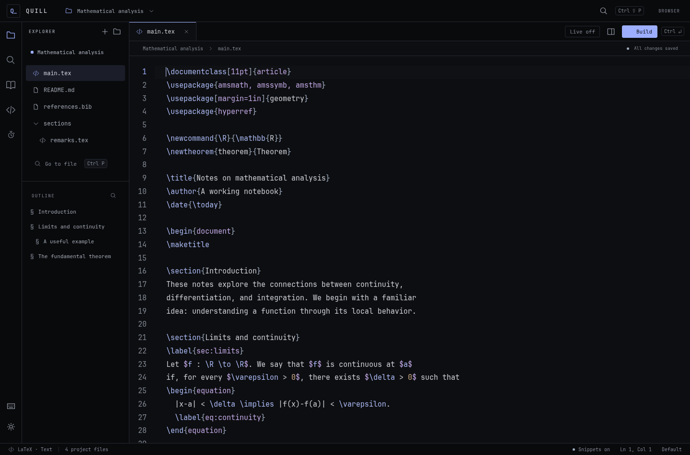

# Quill 0.2

A keyboard-first desktop LaTeX editor built around fast mathematical typing. Open ordinary `.tex` files in ordinary folders. Configuration is portable JSON.



## Run

Requires Node.js 22.18+ and npm. A local TeX distribution is needed for compilation.

```sh
npm install
npm run desktop
```

In the desktop app, press **Ctrl+O** to open a project. The included `examples/math-notes` folder is ready to compile with `latexmk`.

```sh
npm run dev
```

The development browser version opens a sample project and persists edits in local storage. Use the command palette to import or download source files. Folder access, local compilation, filesystem watching, and local PDF loading require the desktop app.

## Implemented in this release

- Electron desktop shell with isolated preload API, CodeMirror 6 editor, syntax highlighting, history, multiple selections, and rectangular selections (Alt-drag).
- Project explorer, create/rename/trash files, create/rename folders, tabs, fuzzy Quick Open, pinned files, recent projects, and reopening closed files.
- Configurable automatic/manual snippets with nested tab-stop sessions; math/text, comment, environment, argument, line, whitespace, and character conditions; priority, groups, enable/disable, import/export, bounded regex triggers, and opt-in bounded recursion.
- Smart pairs for braces, brackets, parentheses, inline/display math, escaped math delimiters, and left/right delimiter insertion. Configurable math superscripts/subscripts. Structural argument, brace, command, environment, and math navigation.
- Worker-based changed-file indexing; outline and symbol search; completion of common commands, user commands, labels, citation keys with metadata, environments, paths, and common packages.
- File find/replace (including regex), project search, definition lookup, multi-selection wrapping.
- Command palette, editable contextual/chord keybindings with conflict reporting, a near-black monospace interface with configurable accent and syntax colors, visual settings, snippet editor, profiles, JSON editing, and declarative macros.
- Asynchronous latexmk/pdflatex/xelatex/lualatex compilation, cancel command, bounded output log, source-linked file/line diagnostics, build on save, and optional embedded PDF.js preview with page and zoom controls.
- Hash-checked saves, external-change notifications, auto-save option, disk-backed crash recovery, and recover-on-project-open.

## A fast writing workflow

Inside mathematics, type `fr/` to insert `\frac{}{}`. Type `sq/` in its numerator, fill the square root, then use Tab to leave the root and Tab again to enter the fraction's denominator. Nested sessions preserve the parent tab stops.

| Shortcut                  | Default action                                 |
| ------------------------- | ---------------------------------------------- |
| Ctrl+P                    | Quick Open                                     |
| Ctrl+Shift+P              | Command palette                                |
| Ctrl+Shift+O              | Project symbols                                |
| Ctrl+S                    | Save                                           |
| Ctrl+Enter                | Build                                          |
| Alt+F                     | Next outermost argument                        |
| Alt+A                     | Previous outermost argument                    |
| Ctrl+F in prose           | Find / replace                                 |
| Alt+D                     | Next logical position (nested arguments first) |
| Alt+S                     | Previous logical position                      |
| Tab / Shift+Tab           | Next / previous snippet stop                   |
| Ctrl+Tab / Ctrl+Shift+Tab | Next / previous file                           |
| Ctrl+Shift+T              | Reopen closed file                             |
| Ctrl+D                    | Select next occurrence                         |
| Ctrl+Alt+S                | Snippet editor                                 |
| Ctrl+,                    | Settings                                       |

`Mod` in configuration means Ctrl on Linux/Windows and Command on macOS. An explicit `Ctrl` remains Control on macOS. Type chords as `Mod-k Mod-s`. Context bindings take precedence over global bindings. Some operating-system shortcuts may be intercepted before the app receives them.

For example, `Alt+D` moves `\frac{|3x^{2}}{1}` to `\frac{3x^{|2}}{1}`.
Further presses leave the superscript, enter the denominator, and exit the fraction.
`Alt+S` reverses those stops. From anywhere in a plain denominator, it moves back to the numerator: `\frac{3x^2}{1 |}` → `\frac{|3x^2}{1 }`. Navigation moves the cursor without changing text or whitespace.
The separate **Move outside current braces** and **Move inside nearest braces** commands remain available in the palette and keybinding editor.
Existing configurations using the original default Alt+Right and Alt+Left bindings are upgraded on load;
other custom bindings are preserved. `keybindingDefaultsVersion: 4` records the updated defaults
and allows explicitly rebinding either shortcut to its old command if desired.

The primary brace shortcuts are **Alt+A/F** for previous/next outermost argument and **Alt+S/D** for the existing local structural stops. Alt+F moves directly from `\frac{3x^{2x^{|2}}}{3x^{2}}` into the denominator; Alt+A returns from its nested exponent to the numerator. Inner brace pairs are skipped by the outer argument commands. At the last outer pair, forward exits it; at the first, backward returns to its start.

**Alt+E** moves to the end of the next term and **Alt+W** to the beginning of the previous term. For `3x+5x`, forward stops are `3x|+5x` then `3x+5x|`; backward stops are `3x+|5x` then `|3x+5x`. Separators are `+`, `-`, `\cdot`, `\times`, and whitespace. These are lexical jumps: they also see operators inside braces; escaped characters and whole command names stay atomic. **Alt+R/Q** jump to the actual end/beginning of the source line, including indentation.

Version 4 adds the term/line shortcuts on configuration load if their keys are free. Existing custom Alt+A/F and Alt+S/D bindings are preserved, as are legacy arrow bindings. Only untouched Ctrl+F/Ctrl+Shift+F math argument defaults migrate to Alt+F/Alt+A. All commands remain editable in Keybindings and work in practice as well as the project editor.

## Term editing and clipboard

- **Alt+P** selects the containing/nearest term. Repeating extends the selection one term to the left, including the separator: `3x+5x|` → `3x+[5x]` → `[3x+5x]`.
- **Alt+O** cuts selected text; with no selection, cuts backward to the previous term start. Intervening operators/spaces are included when cutting from a separator, matching Alt+W's boundary.
- **Alt+I** cuts the contents of the innermost enclosing `{...}` while keeping both braces. It does nothing outside braces or inside an empty pair. Escaped braces and commented braces do not count.
- **Alt+L** pastes plain text from the system clipboard, replacing the selection if present.

These commands work in both editors and are available in the palette/keybinding editor. Cuts confirm a successful clipboard write before deleting; clipboard failure leaves source intact. If the document or selection changes while clipboard access is pending, the edit is cancelled. Cut and paste each have their own undo step. Multiple selections cut in document order, separated by newlines; overlapping brace targets are cut once. Practice pastes remain unranked.

Configuration version marker `keybindingDefaultsVersion: 5` assigns these four requested keys on upgrade, replacing older actions on them (including Alt+P's previous math-end assignment). Subsequent customization is preserved.

## PDF preview

Toggle the side-by-side PDF pane with **Ctrl+Shift+V**. The embedded renderer includes page navigation, fit-to-width, and 25–800% zoom. Building preserves the current page, relative vertical position, horizontal scroll, and zoom. The previous PDF stays visible until the replacement's visible pages finish rendering; failed updates leave it intact. Preview position is remembered per project/PDF across sessions, and the nearest available page is used if a rebuilt document becomes shorter.

Drag the divider between source and PDF to resize the pane; its width is remembered. The divider is keyboard accessible (Left/Right arrows, Home/End), and double-click resets its width.

- Middle-click a location to zoom in there; Shift+middle-click zooms out.
- Hold the middle button and drag to pan the document horizontally and vertically without changing zoom.
- Ctrl+mouse-wheel also zooms at the pointer. Normal wheel scrolling still scrolls.
- The toolbar provides +/− buttons, numeric presets, and Fit width.

Use **Detach PDF window** in the PDF header or command palette to move the reader into a separate, freely movable/resizable desktop window. **Reattach** returns it to the editor; closing the detached window also restores it. The same reader retains its document, page position and zoom, and continues receiving build/live updates. The browser demo uses a popup and needs popups allowed. The detached viewer depends on the main app remaining open.

Only pages around the viewport retain canvases. PDF parsing runs in a worker, and rendering assets ship locally; the preview needs no external viewer or CDN. This release preserves a page-relative position rather than a source-text anchor—major edits that move text between pages still require navigation until SyncTeX is implemented. PDF text selection, annotations/links, and search are follow-up work.

## Live preview

The live-rendering implementation is now part of the main application. Click **Live off** to enable it in a desktop project. Unsaved buffers compile in a reusable temporary project; source files stay untouched. The last valid PDF remains visible during compilation or incomplete syntax, with scroll and zoom preserved. Manual **Build** stops live mode and compiles the saved project normally.

Configure the typing pause (100–2000 ms, default 350) and full/fast mode in **Settings → Editor**. Full mode resolves references using latexmk; fast mode uses one engine pass and may show stale references or citations. Rendering speed depends on the document and installed TeX engine. See [measured feasibility results](research/FEASIBILITY.md).

The pre-live snapshot remains at `snapshots/before-live-20260910-183948/project`; its sibling `RESTORE.md` describes recovery. The isolated experiment remains under `experiments/live-rendering`. Development and desktop launch commands now run the promoted main version.

## Appearance

Open **Settings → Appearance** or find **Customize appearance and colors** in the command palette. All interface text uses a system monospace stack. Surfaces stay near-black; Iris, Ice, Amber, and Mono presets set interface accents, cursor and selection. Every color role accepts a color picker or an arbitrary six-digit hex value, including independent command, keyword, string, number, comment, error, and warning colors.

Edits preview immediately. Save globally or for the current project; closing settings without saving restores the previous colors. Profiles and configuration export/import include every color field. Legacy light profiles migrate to dark while retaining other settings. Font size and line height remain in **Settings → Editor**.

## Typing practice

Open the stopwatch icon in the activity bar, or run **Open typing practice** from the command palette. Assign a shortcut to that command in Keybindings if desired. Practice has its own compact CodeMirror editor and never changes project source files. It uses the current snippets, smart delimiters, structural movement, completion settings, and declarative macros. Keep the supplied `\[` / `\]` wrapper to activate math-context typing rules.

Choose **Physics** or **Mathematics**, then Short, Standard, or Extended. A compositional grammar builds nested expressions instead of filling fixed equation templates. It mixes fractions, functions, derivatives, integrals, sums and products with quantum states, vector calculus, statistical mechanics, transforms, mechanics, tensors, sets, logic, analysis, topology, probability, matrices, maps and piecewise functions. Equation forms vary from single expressions to relations, definitions, chains and aligned systems. Length controls the expression budget and source-size cap. Session history avoids the last five or six topics and retries recent structural shapes, so changing symbols is not the only source of variety. Prompts are syntactically valid drills, not assertions of physical or mathematical truth.

Target and input render as white SVG on black, using bundled MathJax 4 and local font chunks. No TeX installation, PDF compilation, or network service is used. The supported equation subset includes MathJax's [AMS](https://docs.mathjax.org/en/latest/input/tex/extensions/ams.html), [physics](https://docs.mathjax.org/en/latest/input/tex/extensions/physics.html), mathtools and boldsymbol extensions. This is not a full LaTeX package engine: document preambles, arbitrary `\usepackage`, and project-defined macros are not interpreted. Unsupported or incomplete input keeps the previous render with an explicit status.

The timer starts on the first edit and stops at the edit that completes the equation, excluding render time. Live speed counts current source characters per minute; a completed score uses the target's non-whitespace LaTeX character count, so snippets and completion reward efficient output. Matching ignores math spacing and accepts identical parsed notation (for example `\frac` and `\dfrac`); it does not prove algebraic equivalence. Some alternative groupings may still need the shown source form.

Source hints, paste/drop, and attempts shorter than one second are unranked. The top ten scores per style/length are saved locally under `quill.practice.scores.v1` in application/browser local storage. These are personal practice records, not tamper-resistant competition scores. Local records are separate from project files and are not synchronized between the browser and desktop app. After a match, Enter on the focused **Next equation** button starts another drill.

## Configuration

Global settings live under Electron's `userData/configuration` directory (usually `~/.config/quilltex/configuration` on Linux):

- `settings.json`: version, editor/build settings, macros
- `snippets.json`: snippet array
- `keybindings.json`: binding array

Project overrides are in `.quill/settings.json`. Project settings overlay global settings. Visual settings can save globally or to the current project. Project configuration is watched; use **Reload configuration from disk** after editing global files externally. Imports validate before replacing active configuration.

Snippet syntax is `${1}`, `${2:default text}`, and `$0` for the final position. A template without `$0` gets an implicit final stop. Repeated numbers are separate stops in this release, not synchronized mirrors. Regex triggers intentionally support only bounded simple patterns: no quantifiers, lookarounds, or backreferences. Advanced regex replacement captures are not implemented.

```json
{
  "id": "fraction",
  "name": "Fraction",
  "trigger": "fr/",
  "replacement": "\\frac{${1}}{${2}}$0",
  "context": "math",
  "group": "Mathematics",
  "kind": "literal",
  "enabled": true,
  "auto": true,
  "priority": 10,
  "outsideComments": true,
  "retainTrigger": false,
  "recursive": false
}
```

Macros are arrays of insertion and command steps. Configure them in Profiles & JSON, then use **Run a custom macro**. Command IDs are visible in the exported keybindings and command registry.

```json
{ "id": "fraction", "name": "Insert fraction", "steps": [{ "insert": "\\frac{${1}}{${2}}$0" }] }
```

The built-in compiler adapters accept a bounded list of TeX options and always disable shell escape. `latexmk` project/user rc files are disabled. Arbitrary shell build recipes are not enabled in this release.

## Validation

```sh
npm test
npm run build
npm run dev                 # leave running for browser tests
npm run test:browser
npm run test:desktop        # build first; requires a display and latexmk
npm run test:live
npm run test:live:desktop   # native live rendering and position retention
npm run test:practice       # generator, notation matching, scoring
npm run test:practice:desktop # build first; bundled SVG renderer
npm run test:clipboard:desktop # native clipboard bridge, build first
```

Browser tests use `/usr/bin/chromium` by default; set `PLAYWRIGHT_CHROMIUM_EXECUTABLE` to your executable or install Playwright Chromium and omit the executable override. The desktop smoke test creates a temporary project, opens the native app, verifies that a conflicting save is rejected, compiles a real PDF, and checks actual PDF rasterization. It rebuilds a multi-page PDF with changed page dimensions and verifies that page, zoom, and relative scroll position survive; it also verifies that a failed update leaves the previous PDF visible. Test runs disable Chromium's sandbox only for automated testing in this environment; the application launcher does not do so.

## Scope and next milestones

This is a functional first release, not the complete 27-section specification. [Architecture and milestones](docs/ARCHITECTURE.md) define the subsystem APIs and rollout.

Outstanding work includes additional spell-checking languages; PDF text selection/search and link annotations; project-wide replacement; matrix/alignment-specific movement; paired delimiter transformations; synchronized snippet mirrors; automatic expansion across multiple cursors; custom movement-rule definitions; richer completion-source controls; automatic matching edits to existing begin/end names; plugin loading; and packaged installers.

The lightweight LaTeX parser is not a TeX interpreter. Catcode changes, arbitrary macro expansion, verbatim syntax, and complex BibTeX nesting need deeper parsing. Large-file typing and large-project indexing need broader benchmarks before making latency guarantees. Recovery is debounced by 450 ms; a forced process termination can lose the last fraction of a second. Saving compares disk hashes and uses an atomic replacement, but cannot provide a cross-process filesystem transaction against another program writing in the final rename window. Windows process-tree cancellation needs platform-specific hardening.

### Custom term boundaries

In **Settings → Editor → Term navigation**, edit the boundary list (one literal per line) and the whitespace toggle. Changes apply immediately to both editors and are saved with global/project settings and profiles. Alt+E moves to the current expression end or crosses one boundary when already at its edge; Alt+W reverses these steps. Consecutive boundaries are separate steps: `3x^2|++x` → `3x^2+|+x` → `3x^2++|x`. Command delimiters and custom multi-character boundaries stay atomic. Alt+P and Alt+O use the same boundary definitions while retaining their expression selection/cutting behavior.

Defaults split at `+`, `-`, `\cdot`, `\times`, whitespace, `$`/`$$`, `\(`/`\)`, `\[`/`\]`, round/square brackets, and their `\left`/`\right` forms. Curly braces remain within terms. Thus `$5x|+3$` moves back to `$|5x+3$`, and `3|\left(x^2\right)` moves forward to `3\left(|x^2\right)`. Escaped dollars and complete command names remain atomic. Boundaries are literal strings, not regexes; multi-token operators such as `<=` are supported. JSON fields are `settings.termSeparators` and `settings.termWhitespace`.

### Soft wrapping

**Settings → Editor → Wrap long lines** is on by default. It wraps the main and practice editors, multiline configuration/snippet fields, source hints and build logs to their available width. Turning it off allows horizontal scrolling. This is visual wrapping only: source text, saved line breaks and structural navigation remain unchanged. The preference is stored as `settings.wordWrap` in global/project settings and profiles and applies without restarting.

### Spell checking

English (US) spelling is checked offline after a 450 ms typing pause. Wavy underlines mark suspect prose. Math, command names, labels/references/citations, URLs, common metadata/definition arguments, and verbatim/code environments are excluded. Prose within `\text{…}` is checked even inside math. Comments are ignored by default. The scanner is conservative syntax awareness, not a full TeX macro interpreter; unknown custom macro arguments may need a personal dictionary or file exclusion.

- **F7**: next spelling issue, wrapping to the first.
- **Shift+F7** or right-click an underlined word: a compact dropdown beside the word, with corrections, session ignore, and dictionary actions. Arrow keys navigate, Enter chooses, and Escape dismisses. Clicking elsewhere or scrolling closes the dropdown.
- **Settings → Editor**: enable spelling and optionally check comments. Save with project scope for a project-specific preference.
- **Settings → Spelling**: edit separate global/project word lists, clear session ignores, and edit excluded file paths.
- Command palette: **Toggle spell checking for current file/project**, **Spelling suggestions**, **Next spelling issue**, **Manage spelling dictionaries**. Shortcuts are customizable; existing F7 assignments are preserved.

Native dictionaries are human-readable JSON word arrays at the application's `configuration/dictionary.json` and the project's `.quill/dictionary.json`. The browser demo stores the two scopes separately in local storage. Dictionaries are separate from profiles and settings; session ignores are not persisted. Global/project words are combined for checking, not copied between files. The initial dictionary is US English; add technical names or alternate spellings as personal words. nspell and the SCOWL-derived dictionary are bundled with license notices in `docs/NSPELL-LICENSE.txt` and `docs/SPELLING-DICTIONARY-LICENSE.txt`.

Run `npm run test:spelling` for the prose scanner/dictionary tests and `npm run test:spelling:desktop` after building for the native integration test.

### SyncTeX navigation

Build once, then use **Ctrl+Shift+J** (Cmd+Shift+J on macOS), or **Show source in PDF (SyncTeX)** in the command palette. The preview opens at the source position with a temporary marker and preserves your zoom. Customize the shortcut in Keybindings.

**Ctrl-click** (or Cmd-click) typeset text in the PDF to open the corresponding project source and line. This also works in the detached PDF window and brings the main editor forward. Click text rather than blank margins for the most useful match. SyncTeX often identifies a line or typesetting box, rather than an exact character.

The desktop app uses the local `synctex` executable supplied with TeX distributions. Normal builds use the existing `-synctex=1` default; live builds now always generate synchronization data. If an older custom compiler configuration disables SyncTeX, add `-synctex=1` in Editor settings and rebuild. Browser-demo PDFs do not support source synchronization.

The displayed PDF retains its own temporary copy of the SyncTeX map. New builds cannot replace that map underneath it. Unsaved live buffers map back to their original project files; source edits newer than the displayed build are rejected with a rebuild/wait message instead of jumping to an outdated line. PDF files without a usable sidecar remain viewable. Only project-contained source files are navigation targets. TeX macro expansion, generated files, unusual page cropping, and some complex layouts can make SyncTeX positions approximate.

`npm run test:synctex` tests real TeX forward/inverse mappings and immutable snapshots; `npm run test:synctex:desktop` tests source/PDF navigation, included files, detached preview and unsaved live builds. Both require a TeX installation.

### LaTeX delimiter highlighting

**Settings → Delimiters** controls the structural highlighting shared by the main and practice editors. Choose a preset and **Save highlighting**:

- **Prism**: matching delimiters share a color by nesting depth.
- **Blueprint**: colors distinguish delimiter families.
- **Focus**: emphasizes the cursor’s active pair with a subtle scope tint.
- **Contrast**: vivid nesting colors with a filled active-pair highlight.

Customize one to twelve palette colors, active/error colors, outline/fill/underline emphasis, scope tint, environment highlighting and unmatched warnings. Disable the system entirely if preferred. Ordinary command, number and comment syntax colors remain configurable under Appearance. Settings persist globally or per project and travel with profile JSON as `settings.delimiterHighlight`.

Matching covers braces, parentheses, square brackets, math boundaries (`$`, `$$`, `\(`, `\[`), named angle/norm/floor/ceiling fences, sized `\bigl`/`\bigr` variants, `\left`/`\right`, `\middle`, and named environments. Complete sizing commands are highlighted together with their glyph. Asymmetric pairs and invisible dots are valid; escaped literal braces are distinct from argument braces. Hover a matched delimiter for its partner’s line and column. The innermost pair follows the cursor, with support for multiple selections. Comments, inline verbatim and common code environments are excluded.

This is lexical LaTeX awareness rather than macro expansion: delimiters synthesized by custom macros cannot be inferred. Unadorned `|` characters are left alone because they also mean divisibility or conditional notation; explicit norm commands and sized bars are recognized. Unmatched highlighting can be turned off while drafting incomplete expressions.

Parsing runs in a worker after an 80 ms editing pause. Cursor movement reuses the index; only visible ranges receive decorations. Tests: `npm run test:highlighting`, browser highlighting tests, and `node tests/highlighting-desktop.mjs` after building.
